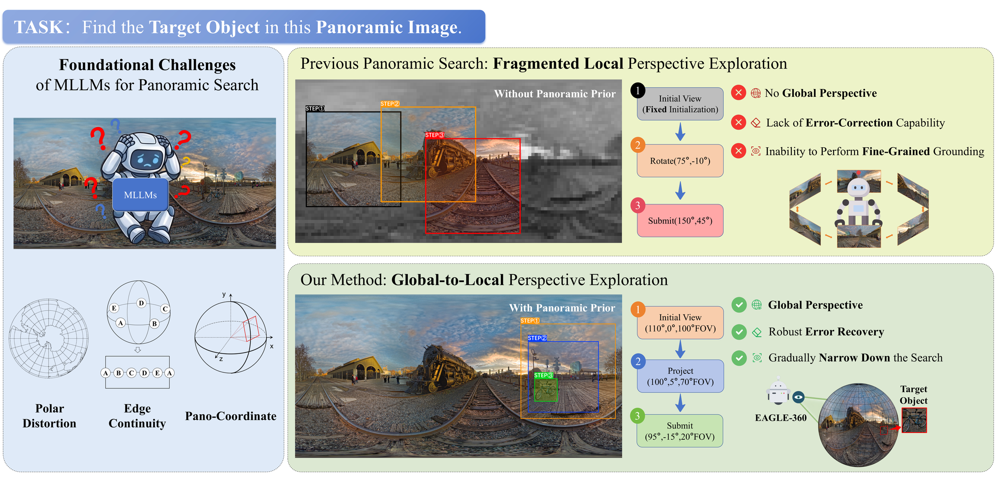
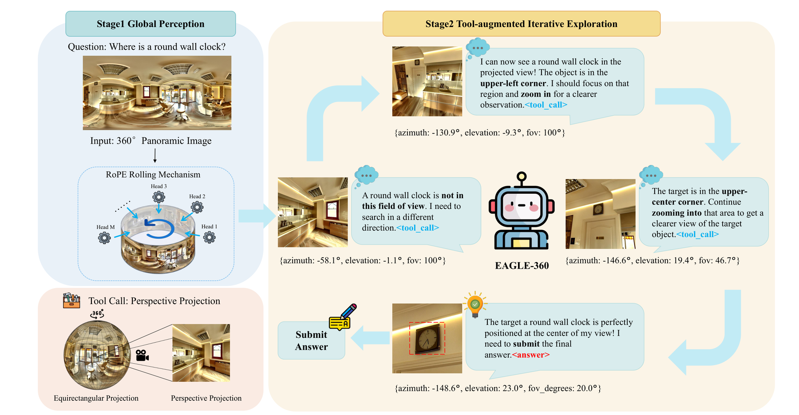

# EAGLE-360: Embodied Active Global-to-Local Exploration in 360°

<div align="center">
  <b>Jingtao Xu</b><sup>1</sup>, <b>Zizhuo Lin</b><sup>1</sup>, <b>Jianwen Sun</b><sup>2</sup>, <b>Yi Yang</b><sup>1</sup>, <b>Yawei Luo</b><sup>1*</sup>
  <br>
  <sup>1</sup>Zhejiang University &nbsp;&nbsp; <sup>2</sup>Central China Normal University
  <br>
  <sup>*</sup>Corresponding author
</div>

<br>

<div align="center">
  <a href="#"></a>
  <a href="https://huggingface.co/Sansjudge/eagle360_qwen3vl_grpo"></a>
  <a href="https://huggingface.co/datasets/Sansjudge/eagle360_test"></a>
  <a href="#running-evaluation"></a>
</div>

<br>



## Overview

EAGLE-360 studies active object search in 360° panoramic environments. Given an equirectangular panorama and a target description, the model reasons over the global scene, calls a projection tool to inspect local perspective views, and finally predicts the target azimuth and elevation.

Instead of relying on fragmented local exploration from a fixed initial view, EAGLE-360 follows a global-to-local strategy: it first uses panoramic priors to choose a promising direction, then progressively narrows the search space through multi-turn tool use. The inference stack includes Rolling RoPE support for panoramic images and a vLLM-based evaluator.



## Highlights

- Global-to-local panoramic exploration for embodied 360° visual search.
- Rolling RoPE support for continuous equirectangular panoramas.
- Multi-turn tool-calling inference with `rotate_and_project_panorama`.
- GRPO training improves search accuracy and exploration efficiency.
- Lightweight evaluation code for reproducing the 50-sample Matterport3D result.


## Getting Started

### Installation

```bash
git clone https://github.com/Sansju/EAGLE-360.git
cd EAGLE-360
bash install.sh
```

The script installs `vllm==0.11.0`, `transformers==4.57.0`, `torch==2.8.0`, and applies the panoramic Rolling RoPE patches.

For manual installation:

```bash
pip install -r requirements.txt

VLLM_DIR=$(python -c "import vllm,os; print(os.path.dirname(vllm.__file__))")
TRANS_DIR=$(python -c "import transformers,os; print(os.path.dirname(transformers.__file__))")
cp -r patches/vllm/* $VLLM_DIR/
cp -r patches/transformers/* $TRANS_DIR/
```

Do not pre-install a different PyTorch CUDA wheel before installing vLLM. `vllm==0.11.0` pins `torch==2.8.0` with CUDA 12.8 dependencies on Linux. `flash-attn` is not required for evaluation; if an old `flash-attn` wheel fails to import with PyTorch 2.8, uninstall it or rebuild it for the same PyTorch/CUDA stack.

### Data

The public EAGLE-360 test split is available on Hugging Face: [Sansjudge/eagle360_test](https://huggingface.co/datasets/Sansjudge/eagle360_test). It contains `test.json` and a flat `images/` directory with 354 renamed panoramic images for 360 test samples.

Download it with:

```bash
huggingface-cli download Sansjudge/eagle360_test \
  --repo-type dataset \
  --local-dir ./eagle360_test
```

`eval.py` resolves images as:

```text
{pano_dir}/{basename(panoramic_image)}
```

For the Hugging Face release, pass `--test_file ./eagle360_test/test.json` and `--pano_dir ./eagle360_test/images`.

### Model Weights

The EAGLE-360 Qwen3-VL GRPO checkpoint is available on Hugging Face: [Sansjudge/eagle360_qwen3vl_grpo](https://huggingface.co/Sansjudge/eagle360_qwen3vl_grpo).

Download it with:

```bash
huggingface-cli download Sansjudge/eagle360_qwen3vl_grpo \
  --local-dir ./checkpoints/hf_merged
```

You can also pass the local checkpoint path directly to `--model`.

## Running Evaluation

Quick 50-sample evaluation:

```bash
python eval.py \
  --model ./checkpoints/hf_merged \
  --test_file ./eagle360_test/test.json \
  --pano_dir ./eagle360_test/images \
  --n_samples 50
```

Full evaluation:

```bash
python eval.py \
  --model ./checkpoints/hf_merged \
  --test_file ./eagle360_test/test.json \
  --pano_dir ./eagle360_test/images
```

Results are saved as `eval_{model_name}_{timestamp}.json`.


## Citation

```bibtex
@misc{xu2026eagle360,
  title  = {EAGLE-360: Embodied Active Global-to-Local Exploration in 360°},
  author = {Xu, Jingtao and Lin, Zizhuo and Sun, Jianwen and Yang, Yi and Luo, Yawei},
  year   = {2026}
}
```

## Acknowledgements

The implementation builds on [vLLM](https://github.com/vllm-project/vllm), [Transformers](https://github.com/huggingface/transformers), and Qwen3-VL. The patch files in `patches/` follow the licenses of their upstream projects.
